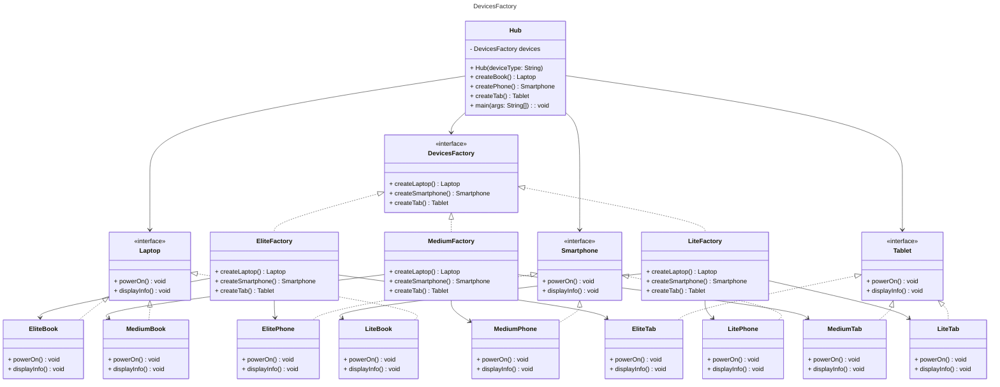

# DevicesFactory

- **AbstractFActory**: `DevicesFactory`;
- **ConcreteFactories**: `EliteFactory`, `MediumFactory`, `LiteFactory`;
- **AbstractProducts**:  `Laptop`, `Smartphone`, `Tablet`;
- **Products**: `EliteBook`, `ElitePhone`, `EliteTab`, `MediumBook`, `MediumPhone`, `MediumTab`, `LiteBook`, `LitePhone`, `LiteTab`;
- **Client**: `Hub`; 

### Structure

*[Alessandro Ferrante](http://alessandroferrante.net)*

*Credits uml diagram* [mermaid](https://mermaid-js.github.io/mermaid/) 