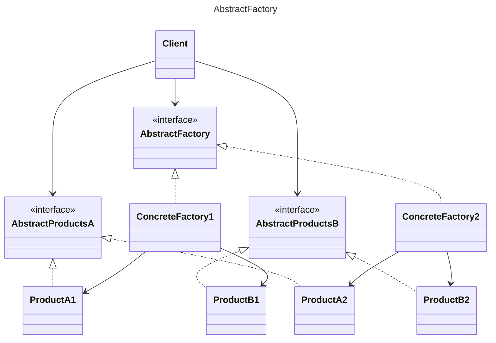
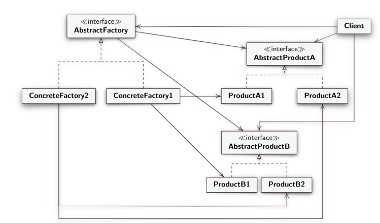

# Design Pattern Abstract Factory
**Creational Design Template**

- **AbstractFActory**: `interface` declares abstract methods to create abstract products;
- **ConcreteFactories**: classes that implement the methods to create a product variant;
- **AbstractProducts**: `interface` declares abstract methods for a set of distinct but related product variants that make up a family of products;
- **Products**: classes that implement the methods to create ***concrete variants*** of the abstract product.
- **Client**: uses and is aware only of `interfaces`;

> - So we can say that `productA1` and `productA2` are the same product but in different variants.
> - Instead `productA1` and `productB1` are different products but of the same variant or family.
> - Furthermore, `AbastractProduct` produces *different products* and `ConcreteFactories` *determine the variant* or general family to produce.

*Credits uml diagram* [mermaid](https://mermaid-js.github.io/mermaid/) 

*[Alessandro Ferrante](http://alessandroferrante.net)*

---

# Design Pattern Abstract Factory
**Modello di progettazione creazionale**

- **AbstractFActory**: `interface` dichiara metodi astratti per creare prodotti astratti;
- **ConcreteFactories**: classi che implementano i metodi per creare una variante di prodotti;
- **AbstractProducts**: `interface` dichiara metodi astratti per un'insieme di varianti del prodotto, distinti ma corellati che costituiscono una famiglia di prodotti;
- **Products**: classi che implementano i metodi per realizzare ***varianti concrete***, del prodotto astratto.
- **Client**: usa ed è a conoscenza solo delle `interface`;
> - Quindi possiamo dire che `productA1` e `productA2` sono lo stesso prodotto ma in varianti differenti.
> - Invece `productA1` e `productB1` sono prodotti diversi ma della stessa variante o famiglia. 
> - In oltre `AbastractProduct` produce *prodotti diversi* e le `ConcreteFactories` *determinano la variante* o la famiglia generale da produrre.

*Credits uml diagram* [mermaid](https://mermaid-js.github.io/mermaid/) 

*[Alessandro Ferrante](http://alessandroferrante.net)*