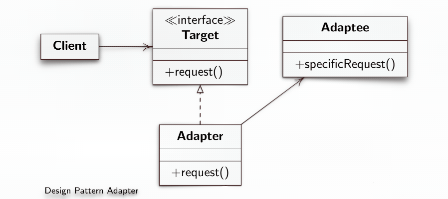

# Desgin Pattern Adapter

**Creational Design Model.**
>Makes interfaces compatible by converting the interface to one that the client expects.

### Structure
   - **Target**: it is the `interface` that the client expects
   - **Adaptee**: it is the class that requires adaptation.
   - **Adapter**: it is the class that converts and adapts the calls to the class that needs adaptation, holds the reference to the Adptee instance and knows how to invoke the methods.
  

*[Alessandro Ferrante](http://alessandroferrante.net)*

---

# Desgin Pattern Adapter

**Modello di Proggettazione creazionale.**
>Rende compatibili le interfacce convertendo l'interfaccia in una che il client si aspetta.

### Struttura
  - **Target**: è l'`interface` che il client si aspetta
  - **Adaptee**: è la classe che necessita l'adattamento.
  - **Adapter**: è la classe che converte e adatta le chiamate al classe che necessita l'adattamento, tiene il riferimento all'istanza di Adptee e sa come invocare i metodi.
  

*[Alessandro Ferrante](http://alessandroferrante.net)*