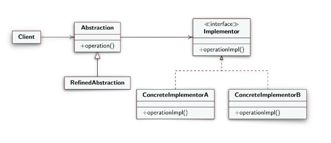

**EN**
# Design Pattern Bridge
Structural design model

- **Intent**: Allow you to split a large class or set of closely related classes into two distinct hierarchies, through abstraction and implementation, that can be developed independently of each other.
- **Reason**: Using inheritance to add various implementations to an abstraction is inflexible as it permanently ties the implementation to the abstraction making it difficult to modify or use abstractions and implementations independently
- **Solution**:
  - **Abstraction**: defines the interface for clients and maintains a reference to an `Implementor` object, forwards client requests to the `Implementor` object;
  - **RefinedAbstraction**: ***extends*** the interface defined by Abstraction;
  - **Implementor**: defines the interface for the implementation classes, provides primitive operations;
  - **ConcreteImplementor**: ***implements*** the `Implementor` interface and provides concrete operations;
  - **Client**: interfaces with the `Abstraction` class;

---

**IT**
# Design Pattern Bridge
Modello di progettazione strutturale

- **Intento**: consentire di suddividere una classe di grandi dimensioni o un insieme di classi strettamente correlate in due gerarchie distinte, attraverso astrazione e implementazione, che possono essere sviluppate indipendentemente l'una dall'altra.
- **Motivazione**: usare l'ereditarietà per aggiungere varie implementazioni a un'astrazione non è flessibile poiché collega permanentemente l'implementazione all'astrazione rendendo difficile modificare o usare astrazioni e implementazioni indipendentemente
- **Soluzione**: 
  - **Abstraction**: definisce l'interfaccia per i client e mantine un rifermiento di un oggetto `Implementor`, inoltra le richieste del client all oggetto `Implementor`;
  - **RefinedAbstraction**: ***estende*** l'interfaccia definita da Abstraction;
  - **Implementor**: definisce l'interfaccia per le classi dell'implementazione, fornisce operazioni primitive;
  - **ConcreteImplementor**: ***implementa*** l'interfaccia di `Implementor` e fornisce operazioni concrete;
  - **Client**: si interfaccia con la classe `Abstraction`;

 