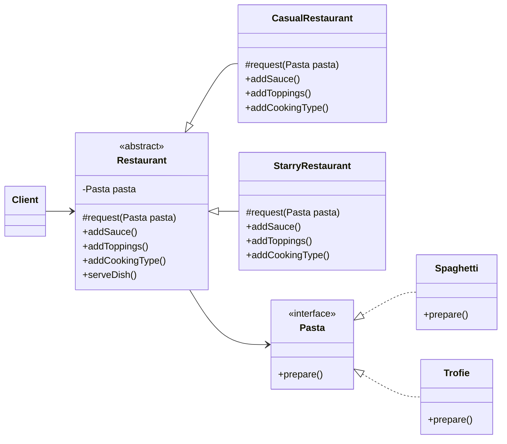

# Restaurant Bridge

- **Abstraction** : `Restaurant`;
- **Refined Abstraction** : `CasualRestaurnat` `StarryRestaurnat`
- **Implementor** : `Pasta`;
- **Concrete Implementor** : `Spaghetti` e `Trofie`
    > *Note! : In this example the classes that implement the Pasta interface provide concrete operations for specific types of pasta, they could also concern, for example, taste*.
  
