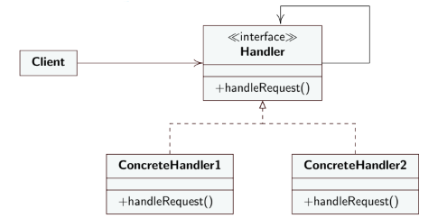

**EN**
# ChainOfResponsibility

- **Intent** : Pass requests along a chain of handlers. After receiving a request, each handler decides whether to process it or pass it to the next handler in the chain;
- **Reason**: decouple sender and recipient, the manager who satisfies the request is not known by the person making the initial request;
- **Solution**
 - `Handler` defines the `interface` to handle requests;
 - `BaseHandler` optional class, to insert the boilerplate code, necessary to manage the chain of responsibility, provides methods to set the next handler, therefore eliminates the need to repeat the raw request handling code in each concrete handler. class `abstract`;
 - `ConcreteHandler` handles the requests for which it is responsible, decides whether to process it and whether to pass it along the chain, ***forwards the request if it cannot handle it***;
 - `Client` starts by making the request to a `ConcreteHandler`

***The request propagates up the chain until a `ConcreteHandler` handles it***

---

**IT**
# Chain Of Responsibility

- **Intento** : passare le richieste lungo una catena di gestori. Dopo aver ricevuto una richiesta, ogni gestore decide se elaborarla o passarla al gestore successivo nella catena;
- **Motivazione** : disaccoppiare mandante e ricevente, il gestore che soddisfera la richiesta non è conosciuto da chi fa la richiesta iniziale;
- **Soluzione**
  - `Handler` definisce l'`interfaccia` per gestire le richieste;
  - `BaseHandler` classe facoltativa, per inserire il codice boilerplate, necessario per gestire la catena di responsabilità, fornisce metodi per impostare il gestore successivo, quindi elimina la necessità di ripetere il codice di gestione delle richieste non elaborate in ogni gestore concreto. classe `abstract`;
  - `ConcreteHandler` gestisce le richieste di cui è responsabile, decide se elaborala e se passarla lungo la catena, ***inoltra la richiesta se non può gestirla***;
  - `Client` inizia effettuando la richiesta a un `ConcreteHandler`

***La richiesta si propaga lungo la catena finchè un `ConcreteHandler` la gestisce***

