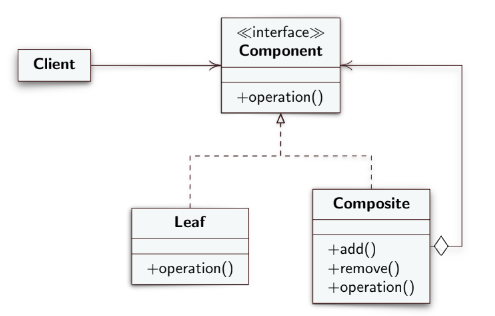

**EN**
# Design Pattern Composite

- **Intent**
Compose objects into tree structures, allowing the customer to treat single and composite objects uniformly.

- **Motivation**
Group simple elements; the distinction between classes makes the code more complicated; allows you to describe a recursive composition. Customers will treat property items uniformly.

- **Solution**
   - **Component**: Interface representing all the elements of the structure.
   - **Leaf**: Class representing simple, "self-describing" elements.
   - **Composite**: Class representing container elements. Holds reference to child elements.
   - **`operation()` method**:
   - In **Leaf** it will do object-specific operations.
   - In **Composite** it calls the method of each child element that makes up the composite object, perhaps scrolling a list with references to the individual children, which can themselves be composite or simple objects.

### Why do we have an aggregation?
Because **Composite** depends on multiple instances of **Component**. In fact, **Composite** has a list with references to individual children that are of type **Component**.

### Transparency
We have transparency in that we treat simple and compound objects the same. The moment I have the `add` and `remove` methods and they can be called on any object, I have transparency; However, in this way I lose my security.

### To guarantee uniformity of the objects I must have:
- **Transparency**: I can achieve it by adding empty `add` and `remove` methods in the **Leaf** class. In this way I also protect because they are empty.
- **Security**: To obtain security I lose the transparency, and therefore the uniformity of the objects. There is no need to add the `add` and `remove` methods in the **Leaf** class.

Transparency and security only apply to the `add` and `remove` methods, they do not affect other operations.

In case I don't use empty methods and use a **Concrete Creator** I will get an error from the compiler telling me that not all objects have the method. To solve this I can use the cast (already seen for the Factory Method).

---

**IT**
# Design Pattern Composite

- **Intento**
Comporre oggetti in strutture ad albero, permettendo al cliente di trattare oggetti singoli e composti uniformemente.

- **Motivazione**
Raggruppare elementi semplici; la distinzione tra classi rende il codice più complicato; permette di descrivere una composizione ricorsiva. I clienti tratteranno gli oggetti della struttura uniformemente.

- **Soluzione**
  - **Component**: Interfaccia che rappresenta tutti gli elementi della struttura.
  - **Leaf**: Classe che rappresenta elementi semplici, "che si autodescrivono".
  - **Composite**: Classe che rappresenta elementi contenitori. Tiene il riferimento agli elementi child.
  - **Metodo `operation()`**:
    - In **Leaf** farà operazioni specifiche dell'oggetto.
    - In **Composite** richiama il metodo di ogni elemento child che compone l'oggetto composto, magari scorrendo una lista con i riferimenti ai singoli child, che possono essere a loro volta oggetti composti o semplici.

### Perché abbiamo un'aggregazione?
Perché **Composite** dipende da più istanze di **Component**. Infatti, **Composite** ha una lista con i riferimenti ai singoli child che sono di tipo **Component**.

### Trasparenza
Abbiamo trasparenza in quanto trattiamo allo stesso modo oggetti semplici e composti. Nel momento in cui ho i metodi `add` e `remove` e possono essere richiamati su qualsiasi oggetto, ho trasparenza; in questo modo però perdo la sicurezza.

### Per garantire uniformità degli oggetti devo avere:
- **Trasparenza**: Posso ottenerla aggiungendo i metodi `add` e `remove` vuoti nella classe **Leaf**. In questo modo proteggo anche perché vuoti.
- **Sicurezza**: Per ottenere la sicurezza perdo la trasparenza, e quindi l'uniformità degli oggetti. Non occorre aggiungere i metodi `add` e `remove` nella classe **Leaf**.

Trasparenza e sicurezza valgono solo per i metodi `add` e `remove`, non influiscono su altre operazioni.

Nel caso in cui non uso metodi vuoti e uso un **Concrete Creator** avrò un errore dal compilatore che mi dirà che non tutti gli oggetti hanno il metodo. Per risolvere questo posso usare il cast (già visto per il Factory Method).