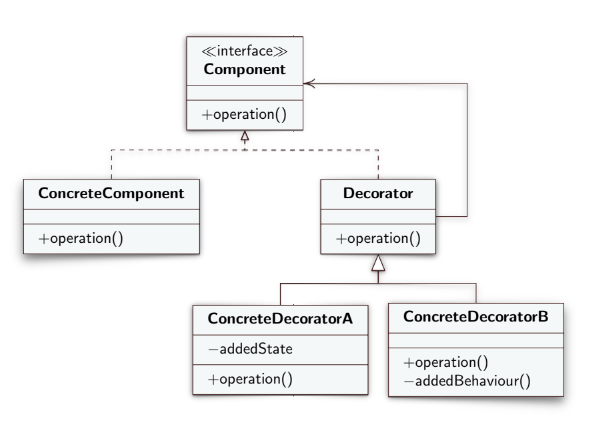

**EN**
# Design Pattern Decorator

Structural design model
> Allow adding and subtracting responsibilities at runtime

> Avoid complicating the Client with different methods for different operations.
## Structure
- **Component**: defines the interface for objects that can have responsibilities added dynamically;
- **ConcreteComponent**: defines an object on which you can add responsibilities;
- **Decorator**: maintains a reference to a Component object, forwards its requests to its Component object, can also do other operations before and after forwarding;
- **ComponentDecorator**: implements the responsibility added to the component;

- `super`: calls the constructor of the superclass and if it is to be used it must be implemented first.

---

**IT**
# Design Pattern Decorator

Modello di progettazione strutturale
> Permettere di aggiungere e sottrarre responsabilità a runtime

> Evita di complicare il Client con metodi  differenti per operazioni diverse.
## Struttura
- **Component**: definisce l'interfaccia per gli oggetti che possono avere aggiunte le responsabilità dinamicamente;
- **ConcreteComponent**: definisce un ogetto su cui poter aggiungere responsabilità;
- **Decorator**: mantiene un riferimento a un oggetto Component, inoltra le sue richieste al suo oggetto Component, puo fare anche altre operazioni prima e dopol'inoltro;
- **ComponentDecorator**: implementa la responsabilità aggiunta al component;

- `super`: richiama il costruttore della superclasse e se deve essere usato bisogna implementarlo per primo.
