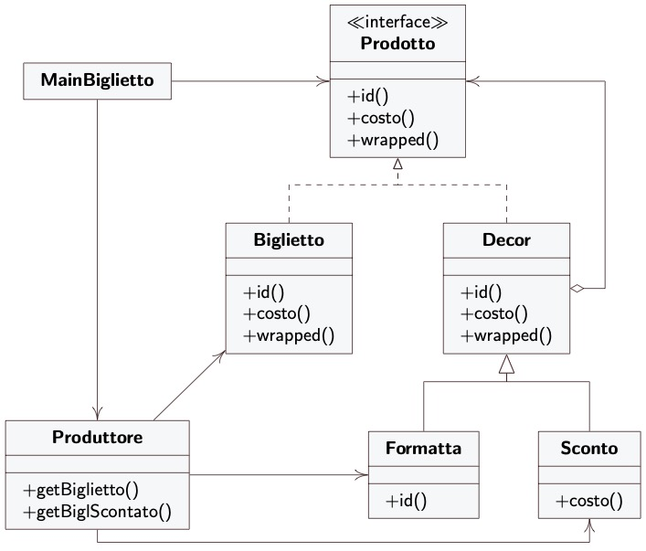

**EN** 
# Ticket Decorator
An example implementation of the Decorator design pattern.
- **Ticket**: it is an interface and a `Component` (the ticket),
- **StadardTicket**: is a `ConcreteComponent`,
- **Decorator**: it is a `Decorator`,
- **Default** and **Discount**: are `ConcreteDecorator`.

The **TicketOffice** class is a **Creator** of the Factory Method design pattern.

The **Client** class is a class that uses the Decorator, (`Client`) design pattern.

---
**IT**
# Ticket Decorator
Un esempio di implementazione del design pattern Decorator. 
- **Ticket**: è un' interfaccia è un `Component` (il biglietto),
- **StadardTicket**: è un `ConcreteComponent`, 
- **Decorator**: è un `Decorator`, 
- **Default** e **Discount**: sono `ConcreteDecorator`.

La classe **TicketOffice** è un **Creator** del design pattern Factory Method.

La classe **Client** è una classe che usa il design pattern Decorator, (`Client`).