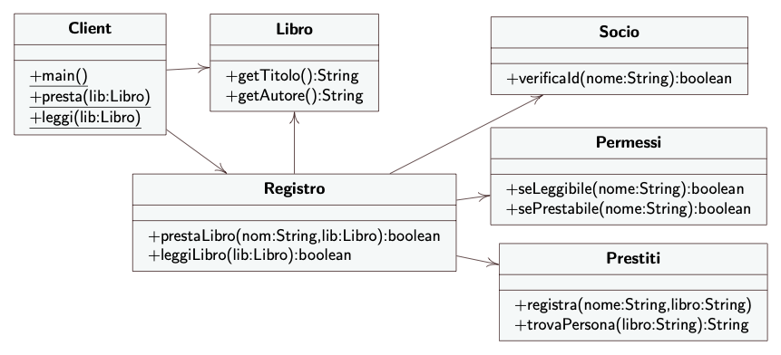

# Library Management
  - **Facade**: `Register`;
  - **Subsystem class**: `Permission`, `Partner`, `Loans`;
  - **System class**: `Book`;
### Structure
  

  *[Alessandro Ferrante](https://alessandroferrante.net)*