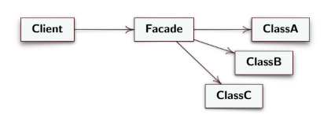

# Facade
**Structural Design Template**

> Provides a simplified `interface` to a library, framework, or any other complex set of classes, further removed from the details of the subsystem's subclasses, increasing the level of abstraction.

### Structure
   - **Facade**: provides a high-level interface, which makes it easier to use the subsystem, reduces complexity, takes care of invoking the methods of the objects it hides
   - **Client**: interacts only with the `Facade`, exploits its simplicity to operate with the subsystem.
  
   > 

*[Alessandro Ferrante](http://alessandroferrante.net)*

---

# Facade
**Modello di progettazione strutturale** 

> Fornisce un'`interfaccia` semplificata a una libreria, un framework o qualsiasi altro insieme complesso di classi, più lontana ai dettagli delle sottoclassi del sottosistema, aumentando il livello di astrazione.

### Struttura
  - **Facade**: fornisce un' interfaccia di alto livello, che rende più facile usare il sottosistema, riduce la complessità, si occupa di invocare i metodi degli oggetti che nasconde
  - **Client**: interaggisce solo con il `Facade`, sfrutta la sua semplictà per operare con il sottosistema.
  
  > 

*[Alessandro Ferrante](http://alessandroferrante.net)* 