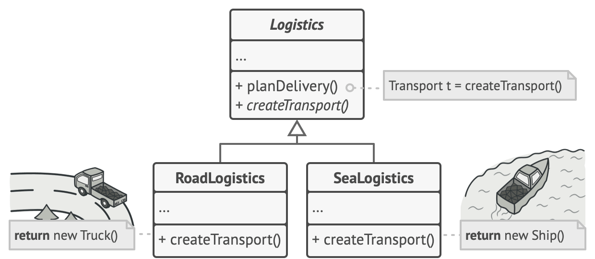
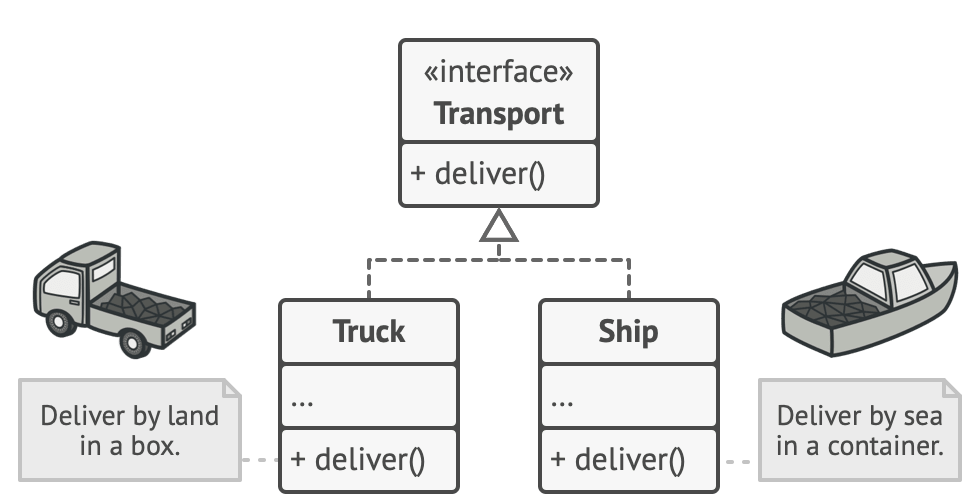

# Logistics Management
**EN**
  - **Creator** -> `Logistics`,
  - **Concrete Creators** -> `RoadLogistics` and `SeaLogistics`;
  - **Product** -> `Transport` *interface*;
  - **Concrete Products** -> `Truk`, `Van` and `Ship`;
 
## Structure
 

### Methods
- `public float delivery(float distance)`: it is declared in `Transport` and is available for all subclasses;
- `public void loadCargo()`: it is declared in `Transport` and is available for all subclasses;
- `public void unloadCargo()`: it is declared in `Transport` and is available for all subclasses;
- `public int capacity(int kg)`: it is declared in `Transport` and is available for all subclasses;
- Other methods can be implemented in subclasses but must be declared as `private`, thus accessible only from the methods of the subclasses themselves, otherwise the `interface` *Transport* must be modified;

*[Alessandro Ferrante](https://alessandroferrante.net)*

---

# Logistic Managment
**IT**
 - **Creator** -> `Logistics`,
 - **Concrete Creators** -> `RoadLogistics` e `SeaLogistics`;
 - **Product** -> `Trasport` *interfaccia*;
 - **Concrete Products** -> `Truk`, `Van` e `Ship`;
 
## Struttura
 

### Metodi
- `public float delivery(float distance)`: è dichiarato in `Trasport` ed è dipsonibile per tutte le sottoclassi;
- `public void loadCargo()`: è dichiarato in `Trasport` ed è dipsonibile per tutte le sottoclassi;
- `public void unloadCargo()`: è dichiarato in `Trasport` ed è dipsonibile per tutte le sottoclassi;
- `public int capacity(int kg)`: è dichiarato in `Trasport` ed è dipsonibile per tutte le sottoclassi;
- Altri metodi possono essere implementati nelle sottoclassi ma deveno essere chiarati come `private`, accessibili così solo dai metodi delle sottoclassi stesse, altrimenti occorre modificare l'`interface` *Transport*;

*[Alessandro Ferrante](https://alessandroferrante.net)* 