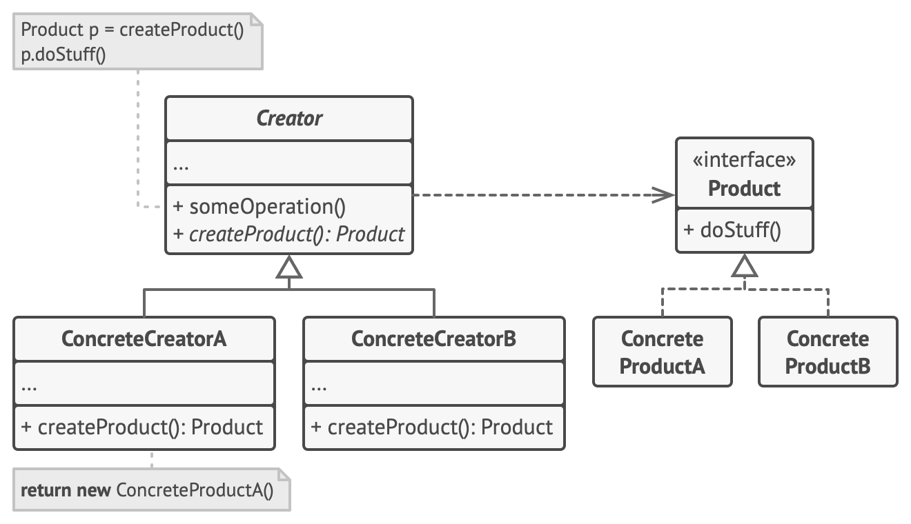

# Design Pattern Factory Method
**EN**

**Creational Design Model.**

>He suggests replacing direct calls to the construction of objects, and therefore to a single specific class, with a class with a special `factory method`, which can be overridden by *subclasses*, returning ***different products***.

>❗ In order to be able to return products of different types, the subclasses require a common base class or interface, which in fact interacts with the different types of products.

### Structure
  - **Creator**: declare the *factory method empty*;
  - **Concrete Creators**: *subclasses* of `Creator`, override the *factory method* and return the `product`;
  - **Product**: `interface` common to all objects produced by the subclasses;
  - **Concrete Product**: they are *subclasses* of `Pruduct` that implement the methods of the different types of products;

*[Alessandro Ferrante](http://alessandroferrante.net)*

---

# Design Pattern Factory Method
**IT**

**Modello di Proggettazione creazionale.**

>Suggerisce di sostituire le chiamate dirette alla costruzione di oggetti, e quindi a una sola specifica classe, con una classe con uno speciale `metodo factory`, che potrà essere sovrascrtitto dalle *sottoclassi*, restituendo ***prodotti diversi***.

>❗ Le sottoclassi per poter restituire prodotti di diverso tipo necessitano di una classe base o un'`interfaccia` comune, che appunto si inferaccia con i diversi tipi di prodotti.

### Struttura
 - **Creator**: dichiara il metodo *factory vuoto*;
 - **Concrete Creators**: *sottoclassi* di `Creator`, sovrascrivono il *metodo factory* e restituisce il `prodotto`;
 - **Product**: `interfaccia` comune a tutti gli oggetti prodotti dalle sottoclassi;
 - **Concrete Product**: sono *sottoclassi* di `Pruduct` che implementano i metodi dei diversi tipi di prodotti;

*[Alessandro Ferrante](http://alessandroferrante.net)* 