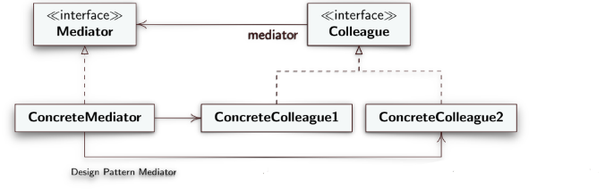

**EN**
# Desing Pattern Mediator

Desing Behavioral Patterns

- **Intent**: Allow you to reduce chaotic dependencies between objects. The pattern limits direct communications between objects and forces them to collaborate only through a mediator object.
- **Motivation**: many connections make an object dependent on others and the entire system behaves as if it were monolithic, making it difficult to change its behavior which is distributed among the various classes.
- **Solution** : Encapsulate the collective behavior in a separate ***mediator*** object, which serves as an intermediary and prevents the objects from depending on each other.
 - **Mediator**: defines an interface for connected objects;
 - **ConcreteMediator**: implements cooperative behavior and coordinates connected objects;
 - **Colleague**: interface of connected objects, communicates with the **Mediator**;
 - **ConcreteCollegue**: they forward and receive requests from a **Mediator** object which takes care of forwarding them to appropriate **ConcreteCollegue**;
 - 

---

**IT**
# Desing Pattern Mediator

Modello di progettazione comportamentale

- **Intento**: consentire di ridurre le dipendenze caotiche tra oggetti. Il pattern limita le comunicazioni dirette tra gli oggetti e li obbliga a collaborare solo tramite un oggetto mediatore.
- **Motivazione**: molte connessioni rendono un oggetto dipendente da altri e l'intero sistema si comporta come se fosse monolitico, rendendo difficilte cambiarne il comportamento che è distribuito tra le varie classi.
- **Soluzione** : Incapsulare il comportamento collettivo in un oggetto ***mediatore*** separato, che serve da intermediario ed evita che gli oggetti dipendano tra loro.
  - **Mediator**: definisce un'interfaccia per gli oggetti connessi;
  - **ConcreteMediator**: implementa il comportamento cooperativo e coordina gli oggetti connessi;
  - **Colleague**: interfaccia degli oggetti connessi, comunica con il **Mediator**;
  - **ConcreteCollegue**: inoltrano e ricevono richieste da un oggetto **Mediator** che si occupa di inoltrarle a opportuni **ConcreteCreator**;
  - 