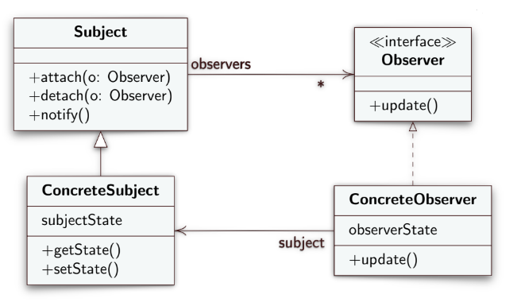
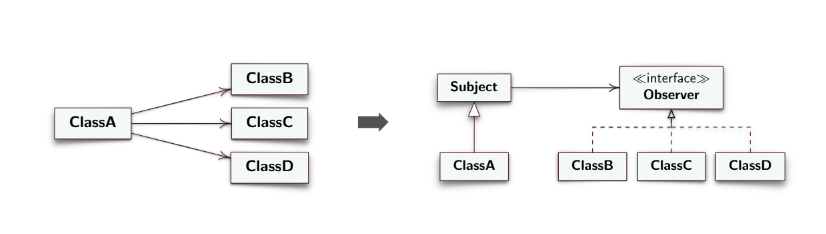
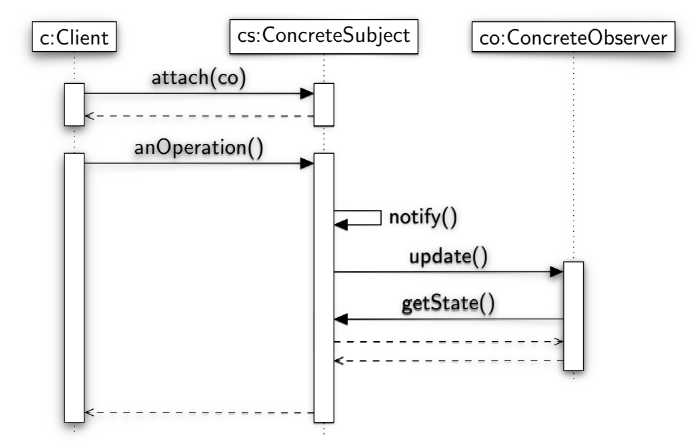

**EN**
# Design Pattern Observer

- **Subject**: knows its observers, any number of Observer objects can observe a Subject. Implements operations to add and remove Observer objects and to notify them;
- **Observer**: defines an interface (update() operation) common to all objects that require notification;
- **ConcreteSubject**: holds the state that interests ConcreteObserver objects. Notifies its observers when its status changes. Inherits from Subject.
- **ConcreteObserver** holds a reference to the ConcreteSubject object, and holds the state that must remain consistent with that of the Subject. Implement Observer to receive
Notifications of Subject changes. After notification you can query the subject per
obtain the new data.

---
### Before and after using observer

### Sequence diagram

**IT**
# Design Pattern Observer

- **Subject**: conosce i suoi osservatori, un qualsiasi numero di oggetti Observer può osservare un Subject. Implementa le operazioni per aggiungere e togliere oggetti Observer e per notificarli;
- **Observer**: definisce una interfaccia (operazione update()) comune a tutti gli oggetti che necessitano la notifica;
- **ConcreteSubject**: tiene lo stato che interessa agli oggetti ConcreteObserver. Notifica i suoi osservatori quando il suo stato cambia. Eredita da Subject.
- **ConcreteObserver** tiene un riferimento all’oggetto ConcreteSubject, e tiene lo stato chedeve rimanere consistente con quello del Subject. Implementa Observer per ricevere
notifiche dei cambiamenti del Subject. Dopo la notifica può interrogare il subject per
ottenere il nuovo dato.

---
### Prima e dopo l'uso di observer

### Diagramma di sequenza
