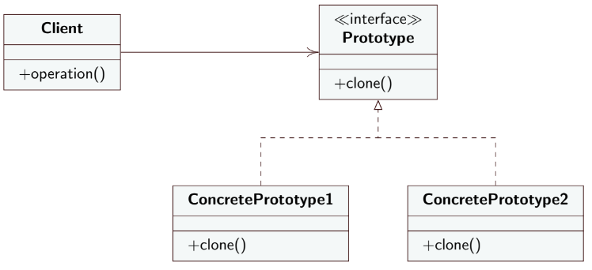

**EN**
# Prototype 
Creative Design Pattern 

- **Intent**: Allow existing objects to be copied without making code dependent on their classes.
- **Motivation**: Need initial state similar to that of an existing object; instance is tightly coupled with class; tight coupling between classes to be instantiated makes it difficult to add new types.
- **Solution**:  - **Prototype**: Interface that `declares` the `clone` method.
- **Concrete Prototype**: `implements` or `declares` the `clone` method.
- **SubclassPrototype**: If present, `implements` the `clone` method; in this case, the **ConcretePrototype** can only define it;
- **PrototypeRegistry**: Allows clients to imagine and retrieve prototypes, typically implemented as a new factory class;
- **Client**: can produce a copy of any object that follows the prototype interface.

**IT**
# Prototype
Modello di progettazione creazionale 

- **Intento**: consentire di copiare oggetti esistenti senza rendere il codice dipendente dalle loro classi.
- **Motivazione**: necessario stato iniziale simile a quello di un oggetto già esistente; l'istanza è strettamente accoppiata con la classe; lo stretto accoppiamento fra classi da instanziare rende difficile l'aggiunta di nuovi tipi.
- **Soluzione**: 
  

   - **Prototype**: interfaccia che `dichiara` il metodo `clone`.
   - **Concrete Prototype**: `implementa` o `dichiara` il metodo `clone`.
   - **SubclassPrototype**: se presente `implementa` il medoto `clone` in questo caso il **ConcretePrototype** lo può solo definire;
   - **PrototypeRegistry**: permette ai client di imagazzinare e recuperare i prototipi, tipicamente implementato come una nuova classe factory;
   - **Client**: può produrre una copia di qualsiasi oggetto che segua l'interfaccia del prototipo.