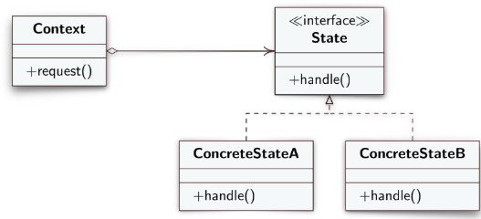

# DesignPatternState
**Behavioral Design Model**
> Allows an object to change behavior based on its internal state at runtime, makes it appear that the object has changed class.

- **Contex**: defines the interface that the Client is interested in, maintains an instance of one of the `ConcreteStates` and delegates the specific work of the state to it.
- **State**: is an interface that declares state-specific methods, valid for all concrete states.
- **ConcreteStates**: implement state-specific methods, determining state behaviors, you can provide intermediate abstract classes that encapsulate some common behaviors.
  
   > Both the `Contex` and the `ConcreteStates` can set the next state of the *Contex* and perform the actual state transition, replacing the *State* object attached to the *Contex*.
  

*[Alessandro Ferrante](http://alessandroferrante.net)*

---

# Design Pattern State
**Modello di progettazione comportamentale**
> Permette a un'oggetto di cambiare comportamento in base al suo stato interno a runtime, fa sembrare che l'oggetto ha cambiato classe.

- **Contex**: definisce l'interfaccia che interessa al Client, mantiene un'istanza di uno dei `ConcreteStates` e delega ad esso il lavoro speficio dello stato. 
- **State**: è un'interfaccia che *dichiara i metodi* specifici dello stato, validi per tutti gli stati concreti.
- **ConcreteStates**: *implementano i metodi* specifici dello stato, determinando i comportamenti dello stato, è possibile fornire classi astratte intermedie che incapsulano alcuni comportamenti comuni.
  
  > Sia il `Contex` che i `ConcreteStates` possono impostare lo stato successivo del *Contex* ed eseguire la transizione di stato effettiva, sostituendo l'oggetto *State* collegato al *Contex*.
  

*[Alessandro Ferrante](http://alessandroferrante.net)*
