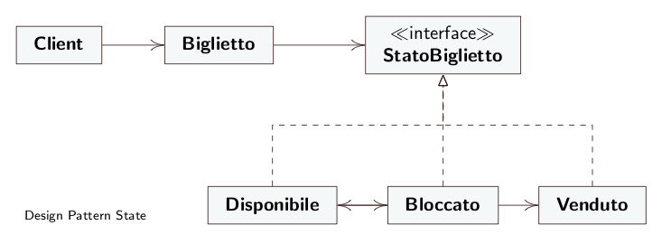

# TicketStatus
- **Contex**: `Ticket`;
- **State**: `TicketStatus`;
- **ConcreteStates**: `Available`, `Blocked`, `Sold`;
  
> The `ConcreteStates` will take care of changing states when necessary.

> The `Contex` instantiates an available ticket on which the basic operations are performed, which will be called by the Client.

### Structure

*[Alessandro Ferrante](http://alessandroferrante.net)*

---

# Ticket Status
- **Contex**: `Ticket`;
- **State**: `TicketStatus`;
- **ConcreteStates**: `Available`, `Blocked`, `Sold`;
  
> I `ConcreteStates` si occuperanno di modificare stato quando necessario.

> Il `Contex` istanzia un biglietto disponibile sul quale vengono effettuate le operazioni di base, che verranno richiamate dal Client.
### Struttura

*[Alessandro Ferrante](http://alessandroferrante.net)*